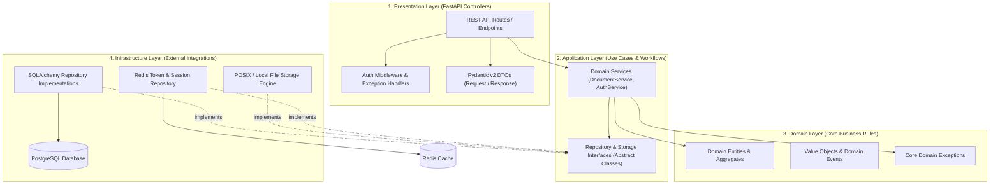

# VaultDocs — Project Overview

> **Document ID:** DOC-001
> **Version:** 1.0.0
> **Status:** Approved
> **Author:** Pavan (Software Architect / Project Lead)
> **Contributors:** Raj (Backend Developer), Tirth (Backend Developer)
> **Created Date:** 2026-07-20
> **Last Updated:** 2026-07-20
> **Classification:** Internal Engineering Documentation

---

## Executive Summary

VaultDocs is an enterprise-grade, secure Document Management System (DMS) built to provide high-throughput, compliant, and auditable digital asset management. Designed around Clean Architecture and Modular Monolith principles, VaultDocs satisfies strict corporate governance, granular access control, version immutability, full-text search capabilities, and multi-tenant security requirements without introducing premature microservice operational complexity.

---

## Table of Contents

1. [Project Vision & Mission](#1-project-vision--mission)
2. [Business Problem Statement](#2-business-problem-statement)
3. [Strategic & Technical Objectives](#3-strategic--technical-objectives)
4. [Project Scope](#4-project-scope)
5. [Stakeholders & Responsibilities](#5-stakeholders--responsibilities)
6. [User Personas](#6-user-personas)
7. [Core Platform Features](#7-core-platform-features)
8. [Technology Stack & Architectural Rationale](#8-technology-stack--architectural-rationale)
9. [High-Level Architecture Overview](#9-high-level-architecture-overview)
10. [Success Metrics & KPIs](#10-success-metrics--kpis)

---

## 1. Project Vision & Mission

### 1.1 Vision Statement
To empower organizations with an uncompromising, cloud-native document management platform that seamlessly balances rigorous compliance and security with exceptional developer ergonomics and user productivity.

### 1.2 Mission Statement
VaultDocs delivers a unified, high-performance Modular Monolith backend using Python 3.13 and FastAPI. By strictly adhering to SOLID design principles and Clean Architecture, VaultDocs provides enterprise users with tamper-evident document versioning, sub-second search, granular access control, and complete operational observability.

---

## 2. Business Problem Statement

Modern enterprises face significant challenges managing critical operational documents, legal assets, financial statements, and engineering specifications across dispersed workforce environments:

1. **Unstructured Data Fragmentation:** Documents are stored in ad-hoc cloud drives, local workstations, and unmonitored file shares without unified metadata, search indexing, or retention policies.
2. **Access Control & Compliance Deficits:** Legacy file management tools lack fine-grained, policy-driven Role-Based Access Control (RBAC), leaving sensitive corporate intellectual property vulnerable to unauthorized disclosure or compliance breaches.
3. **Data Loss & Version Sprawl:** Lack of strict immutable document versioning leads to overwritten assets, inability to track audit history, and loss of critical decision trails during regulatory audits.
4. **Sub-optimal Developer Ergonomics:** Existing enterprise DMS offerings are often closed-source proprietary monoliths that are difficult to integrate into modern API-driven engineering pipelines, CI/CD automation, and custom corporate workflows.

VaultDocs directly addresses these challenges by delivering an API-first, fully auditable document vault with real-time access controls, structured metadata schemas, and automated lifecycle tracking.

---

## 3. Strategic & Technical Objectives

### 3.1 Business Objectives
* **Compliance Assurance:** Provide 100% audit coverage for document lifecycle events (uploads, views, modifications, permission changes, deletions).
* **Operational Efficiency:** Reduce internal document retrieval latency by 75% through structured tag indexing and full-text keyword search.
* **Risk Mitigation:** Guarantee zero unauthorized access incidents through strict JWT-based authentication and attribute-informed RBAC enforcement.

### 3.2 Technical Objectives
* **Sub-200ms API Response Latency (p95):** Deliver rapid endpoint execution across core document metadata and access control operations.
* **Modular Monolith Architecture:** Maintain strict module boundaries (Auth, Document, Storage, Audit) to enable future microservices extraction without code rewrite.
* **100% Type Safety & Strict Quality Controls:** Enforce Python 3.13 static typing via `mypy` (strict mode), code standard compliance via `Ruff`, and pre-commit verification.
* **Production Containerization:** Provide deterministic local and production execution environments via Docker, `uv` dependency management, and PostgreSQL / Redis service isolation.

---

## 4. Project Scope

### 4.1 In-Scope Capabilities
* **User Authentication & Session Security:** OAuth2-compatible JWT issuance, refresh tokens, role enforcement, and password hashing using Argon2id/Bcrypt.
* **Document Core Lifecycle:** Secure chunked multipart upload, metadata storage, dynamic tagging, binary retrieval, soft deletion, and purging.
* **Immutable Document Versioning:** Automatic version incrementing on document content update, historical version retention, and version comparison metadata.
* **Role-Based Access Control (RBAC):** Hierarchical permissions (`Admin`, `Manager`, `Editor`, `Viewer`) applied at tenant, folder, and document levels.
* **Search & Metadata Indexing:** Multi-field filtering (author, file type, creation date, custom tags) and PostgreSQL-backed text search queries.
* **Comprehensive Audit Trail:** Immutable logging of all state mutations and access events with tenant context, client IP, timestamp, and user identity.

### 4.2 Out-of-Scope (Phase 1 Baseline)
* Native Optical Character Recognition (OCR) content extraction from rasterized PDF images (scheduled for Phase 2).
* Vector-based Semantic AI Search and LLM summary generation (scheduled for Phase 2).
* Direct Cloud Blob Provider plugins (AWS S3, Azure Blob, Google Cloud Storage) - initial release relies on POSIX local filesystem abstraction with S3 interface compatibility.
* Mobile Native Applications (iOS / Android) - initial focus is RESTful API backend serving web integrations.

---

## 5. Stakeholders & Responsibilities

The VaultDocs platform development is owned and operated by a lean engineering core with clear architectural and delivery divisions:

| Role | Name | Key Responsibilities |
| :--- | :--- | :--- |
| **Project Lead & Software Architect** | **Pavan** | System architecture design, repository governance, code review, CI/CD pipeline ownership, Docker infrastructure, release approval, documentation leadership. |
| **Backend Developer** | **Raj** | Core API endpoints development, Domain entity modeling, Service layer business logic implementation, Auth & Security module. |
| **Backend Developer** | **Tirth** | Database repository patterns, Alembic schema migrations, Document versioning module, Storage abstraction layer, Unit & integration test suites. |

---

## 6. User Personas

VaultDocs caters to four primary enterprise personas, each possessing distinct operational requirements and access boundaries:

### 6.1 Enterprise System Administrator (Persona: Sarah)
* **Goal:** Maintain infrastructure stability, enforce organization-wide compliance policies, manage tenant lifecycle, and review security audit logs.
* **Pain Points:** Lack of visibility into user activities, difficult tenant onboarding processes, and insecure access controls.
* **VaultDocs Touchpoints:** Admin APIs, Audit Trail dashboards, Global RBAC configurations, Storage quota enforcement.

### 6.2 Compliance & Legal Officer (Persona: Marcus)
* **Goal:** Verify document retention policies, audit intellectual property modifications, ensure tamper-proof historical versions for legal discovery.
* **Pain Points:** Unaudited document deletions, lost edit histories, inability to produce definitive proof of document state at a specific timestamp.
* **VaultDocs Touchpoints:** Audit Trail read APIs, Immutable Version History endpoints, Document Lock controls.

### 6.3 Department Manager / Lead (Persona: Elena)
* **Goal:** Organize team folders, delegate document edit/view permissions to team members, manage active project documentation workflows.
* **Pain Points:** Accidental file overwrites by junior staff, unauthorized sharing of sensitive project docs outside the department.
* **VaultDocs Touchpoints:** Folder management, Access Control Delegation APIs, Metadata Tagging, Bulk Operations.

### 6.4 Knowledge Worker / Developer (Persona: Alex)
* **Goal:** Quickly locate specific technical specs, upload updated revisions, and integrate document storage into automation scripts via REST APIs.
* **Pain Points:** Slow search capabilities, complex integration requirements, lack of standard API error responses.
* **VaultDocs Touchpoints:** REST API endpoints, Full-text Search, Multipart File Upload, Swagger/OpenAPI documentation.

---

## 7. Core Platform Features

```
+-----------------------------------------------------------------------------------+
|                                 VAULTDOCS FEATURES                                 |
+--------------------------+--------------------------+-----------------------------+
|   Auth & Security        |   Document Engine        |   Governance & Search       |
|  - JWT Authentication    |  - Multipart Upload      |  - Fine-Grained RBAC        |
|  - Refresh Token Rotation|  - Immutable Versioning  |  - Full-Text Search         |
|  - Password Hashing      |  - Soft Delete / Restore  |  - Immutable Audit Logging  |
|  - Session Revocation    |  - Metadata Tagging      |  - System Health Probes     |
+--------------------------+--------------------------+-----------------------------+
```

1. **Authentication & Session Lifecycle Management**
   - OAuth2 Bearer Token specification utilizing JSON Web Tokens (JWT).
   - Secure refresh token rotation mechanism backed by Redis fast key-value storage.
   - Fine-grained permission verification embedded directly into FastAPI dependency injection chains.

2. **Document Ingestion & Storage Abstraction**
   - Support for stream-based chunked uploads handling large files without memory exhaustion.
   - Storage provider abstraction pattern allowing seamless backend swapping between local POSIX storage and object stores.
   - SHA-256 content hashing during upload to ensure content integrity and prevent duplicate storage.

3. **Immutable Version Control Engine**
   - Every document update creates a new immutable version record while maintaining pointer to head state.
   - Strict retention of historical version metadata, allowing precise point-in-time document restoration.
   - Storage delta management and checksum verification per version.

4. **Multi-Faceted Search & Indexing**
   - Structured metadata query filters (date ranges, file extensions, ownership, custom key-value tags).
   - PostgreSQL GIN-indexed full-text search capability across document titles, descriptions, and metadata.

5. **Enterprise Audit & Compliance Tracking**
   - Automated event interception logging all write, read, and administrative operations.
   - Structured JSON audit records containing actor ID, tenant scope, operation type, IP address, resource ID, and execution status.

---

## 8. Technology Stack & Architectural Rationale

| Layer / Concern | Technology | Version | Rationale |
| :--- | :--- | :--- | :--- |
| **Language** | Python | `3.13` | Latest performance optimizations, enhanced type hint syntax (`type` statement, `PEP 695`), fast runtime execution. |
| **Web Framework** | FastAPI | `0.115+` | High-performance async WSGI/ASGI execution, native Pydantic v2 integration, automatic OpenAPI generation. |
| **Database** | PostgreSQL | `17+` | Enterprise-grade relational integrity, JSONB support for document metadata, built-in full-text search. |
| **ORM** | SQLAlchemy | `2.0+` | Async-first ORM pattern, strict type hints, clear separation between domain entities and DB models. |
| **Database Migrations**| Alembic | `1.14+` | Deterministic database schema versioning and reproducible migration scripting. |
| **Data Validation** | Pydantic | `v2.10+` | Rust-backed fast validation core, strict schema serialization, type safety guarantees. |
| **Cache & Sessions** | Redis | `7.4+` | Sub-millisecond session state checking, token revocation blacklist, and rate-limiting bucket storage. |
| **Package Manager** | `uv` | `0.5+` | Extremely fast Rust-based Python package resolver and virtual environment manager. |
| **Containerization** | Docker / Compose | `27+` | Multi-stage building for minimal production images and consistent dev environment orchestration. |
| **Quality Control** | Ruff & mypy | Latest | Modern ultra-fast linting/formatting (Ruff) combined with strict static type analysis (mypy). |

---

## 9. High-Level Architecture Overview

VaultDocs follows a **Modular Monolith** pattern structured according to **Clean Architecture** principles. Dependencies strictly flow inward toward the core Domain layer.



### 9.1 Layer Boundaries & Dependency Enforcement
1. **Domain Layer:** Contains raw Python data classes, domain exceptions, and core business rules. Free from external library dependencies (no FastAPI, no SQLAlchemy).
2. **Application Layer:** Orchestrates business use cases. Defines interfaces (`AbstractDocumentRepository`, `AbstractStorageEngine`) using abstract base classes.
3. **Infrastructure Layer:** Implements concrete database access using SQLAlchemy 2.x, POSIX storage writing, and Redis integration.
4. **Presentation Layer:** Exposes RESTful HTTP endpoints via FastAPI, translates HTTP requests into application commands, and returns Pydantic V2 response models.

---

## 10. Success Metrics & KPIs

To validate the success of the VaultDocs implementation, the engineering team evaluates performance against the following quantitative benchmarks:

| Category | Metric | Baseline Target | Target SLA / Goal |
| :--- | :--- | :--- | :--- |
| **Performance** | Metadata API Latency (p95) | `< 200ms` | `< 100ms` |
| **Performance** | File Upload Processing (10MB) | `< 1.5s` | `< 800ms` |
| **Quality** | Unit & Integration Test Coverage | `> 80%` | `> 90%` |
| **Quality** | Static Type Check Passing (`mypy --strict`) | `100% Pass` | `Zero Type Ignores` |
| **Security** | OWASP Top 10 Vulnerabilities | `0 Critical / High` | `0 Medium +` |
| **Reliability** | Docker Container Boot Time | `< 5s` | `< 3s` |
