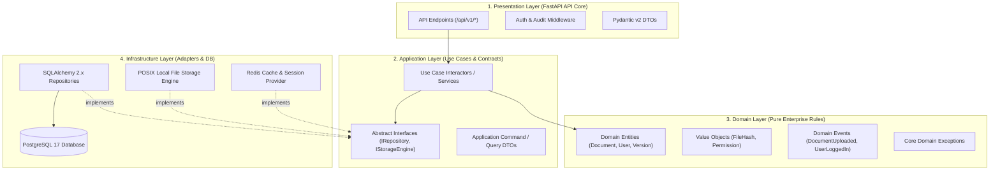
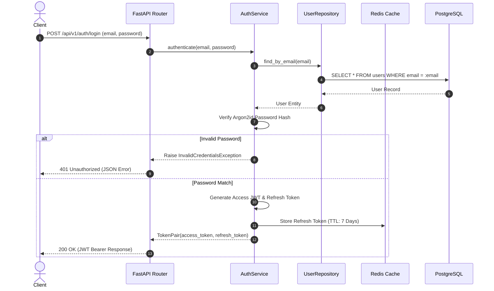
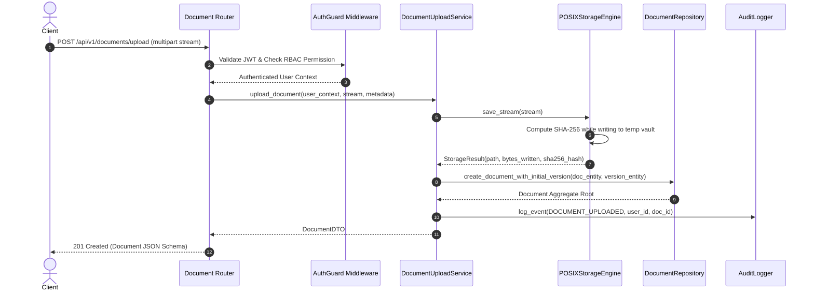
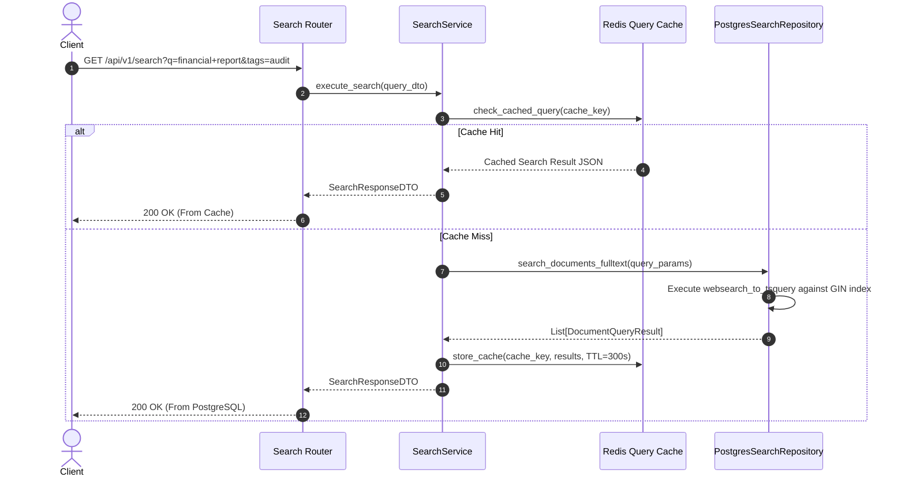

# VaultDocs — System Architecture Specification

> **Document ID:** DOC-003
> **Version:** 1.0.0
> **Status:** Approved
> **Author:** Pavan (Software Architect / Project Lead)
> **Contributors:** Raj (Backend Developer), Tirth (Backend Developer)
> **Created Date:** 2026-07-20
> **Last Updated:** 2026-07-20
> **Classification:** Internal Engineering Documentation

---

## Executive Summary

This System Architecture Specification provides a complete blueprint for the VaultDocs enterprise document management platform. VaultDocs is architected as a **Modular Monolith** applying **Clean Architecture** principles. This document details layer boundaries, module communication patterns, request execution flows, security topologies, error handling mechanisms, logging strategies, configuration management, and Architecture Decision Records (ADRs).

---

## Table of Contents

1. [Architecture Goals & Principles](#1-architecture-goals--principles)
2. [Modular Monolith & Module Boundaries](#2-modular-monolith--module-boundaries)
3. [Clean Architecture Layer Specification](#3-clean-architecture-layer-specification)
4. [Core Execution Flows](#4-core-execution-flows)
5. [Cross-Cutting Concerns](#5-cross-cutting-concerns)
6. [Scalability & Migration Strategy](#6-scalability--migration-strategy)
7. [Architecture Decision Records (ADR)](#7-architecture-decision-records-adr)

---

## 1. Architecture Goals & Principles

VaultDocs is engineered around four core architectural pillars:

1. **Maintainability & Strict Isolation:** Changes in infrastructure (e.g., swapping PostgreSQL storage or switching to S3) must never require modifications to core domain logic.
2. **Testability Without External Mocks:** Core domain entities and application use cases must be testable in isolation without spinning up database servers or external HTTP services.
3. **Operational Simplicity:** A single deployable container image containing a Modular Monolith avoids microservices operational overhead while preserving clean boundaries for future extraction.
4. **Enforced Type Safety & SOLID Adherence:** Strict dependency inversion, single-responsibility services, and explicit Pydantic / Python 3.13 contracts across all module interfaces.

---

## 2. Modular Monolith & Module Boundaries

The VaultDocs system is partitioned into five domain modules housed within a unified codebase. Direct cross-module database joins are strictly forbidden. Modules communicate via internal service interfaces or in-process event handlers.

```
+-----------------------------------------------------------------------------------+
|                            VAULTDOCS MODULAR MONOLITH                             |
|                                                                                   |
|  +--------------------+  +--------------------+  +-----------------------------+  |
|  |    Auth Module     |  |  Document Module   |  |   Version Control Module    |  |
|  | - User Accounts    |  | - Core Metadata    |  | - Version History           |  |
|  | - JWT & Tokens     |  | - Soft Delete      |  | - Delta Tracking            |  |
|  | - RBAC Guard       |  | - Tags & Folders   |  | - Immutability Guard        |  |
|  +---------+----------+  +---------+----------+  +--------------+--------------+  |
|            |                       |                        |                     |
|            +-----------------------+------------------------+                     |
|                                    |                                              |
|                                    v                                              |
|  +---------------------------------+-------------------------------------------+  |
|  |   Storage Engine Module         |    Audit & Governance Module              |  |
|  |  - Stream Ingestion             |   - Structured Event Emissions            |  |
|  |  - POSIX File Vault Provider    |   - Immutable Access Logs                 |  |
|  |  - Checksum Validation          |   - Compliance Verification               |  |
|  +---------------------------------+-------------------------------------------+  |
+-----------------------------------------------------------------------------------+
```

---

## 3. Clean Architecture Layer Specification

Dependencies strictly flow inward. Inner layers know nothing about outer layers.



---

## 4. Core Execution Flows

### 4.1 Authentication & Session Token Issuance Flow



---

### 4.2 Streamed File Upload & Immutable Versioning Flow



---

### 4.3 Full-Text Document Search Execution Flow



---

## 5. Cross-Cutting Concerns

### 5.1 Exception Handling Strategy
VaultDocs uses a global exception interception pipeline in FastAPI. Domain exceptions are mapped deterministically to RFC 7807 problem detail HTTP responses.

```
+-----------------------------------------------------------------------------------+
|                            EXCEPTION MAPPING TOPOLOGY                             |
|                                                                                   |
|  Domain Exception                   Global Exception Handler       HTTP Response  |
|  ------------------                 -------------------------       ------------- |
|  EntityNotFoundException       -->  MapToHTTPStatus(404)       -->  404 Not Found |
|  UnauthorizedException         -->  MapToHTTPStatus(401)       -->  401 Unauth    |
|  PermissionDeniedException     -->  MapToHTTPStatus(403)       -->  403 Forbidden |
|  StorageQuotaExceededException -->  MapToHTTPStatus(413)       -->  413 Payload   |
|  DomainValidationException     -->  MapToHTTPStatus(422)       -->  422 Unprocess |
+-----------------------------------------------------------------------------------+
```

### 5.2 Structured Logging & Observability
All log output is rendered as structured JSON via `structlog` containing correlation trace IDs:

```json
{
  "timestamp": "2026-07-20T12:25:00.123456Z",
  "level": "info",
  "event": "document_uploaded",
  "correlation_id": "req-9b1deb4d-3b7d-4bad-9bdd-2b0d7b3dcb6d",
  "user_id": "usr_01H123456789",
  "tenant_id": "tnt_default",
  "document_id": "doc_01H987654321",
  "file_size_bytes": 10485760,
  "duration_ms": 342.5
}
```

### 5.3 Configuration Management
Settings are loaded cleanly via Pydantic `BaseSettings` reading environment variables:

```python
class Settings(BaseSettings):
    ENVIRONMENT: str = "production"
    POSTGRES_SERVER: str
    POSTGRES_PORT: int = 5432
    POSTGRES_DB: str = "vaultdocs"
    POSTGRES_USER: str
    POSTGRES_PASSWORD: str
    REDIS_URL: str = "redis://redis:6379/0"
    STORAGE_VAULT_PATH: str = "/var/vaultdocs/data"
    JWT_SECRET_KEY: str
    JWT_ALGORITHM: str = "HS256"
    ACCESS_TOKEN_EXPIRE_MINUTES: int = 15
```

---

## 6. Scalability & Migration Strategy

VaultDocs is built as a Modular Monolith, allowing straightforward vertical and horizontal scaling before introducing microservices:

1. **Stateless App Nodes:** Application servers hold no local session state (all session tokens reside in Redis). Scale app nodes horizontally behind a NGINX / Cloud load balancer.
2. **Database Read Replicas:** Read queries (search, catalog listing) can be routed to PostgreSQL read replicas using SQLAlchemy async engine routing.
3. **Future Microservices Extraction Path:** Because modules do not share database tables or foreign keys across domain boundaries, modules like `Audit` or `StorageEngine` can be extracted into standalone gRPC microservices with zero domain code rewrite.

---

## 7. Architecture Decision Records (ADR)

### ADR-001: Adoption of Modular Monolith over Microservices
* **Status:** Accepted
* **Context:** The team needed a high-performance system without operational overheads of distributed microservices.
* **Decision:** Build VaultDocs as a single deployable Python package structured with strict Clean Architecture module boundaries.
* **Consequences:** Simplifies deployment, CI/CD, and local development while keeping module isolation clean.

### ADR-002: Use of PostgreSQL GIN Full-Text Indexing
* **Status:** Accepted
* **Context:** Efficient search capability is required without deploying Elasticsearch in initial releases.
* **Decision:** Use PostgreSQL native `tsvector` with GIN indexing for document metadata search.
* **Consequences:** Eliminates external search cluster costs and data synchronization lag.

### ADR-003: Storage Engine Abstraction Layer
* **Status:** Accepted
* **Context:** Document storage needs local POSIX capabilities today and S3 object storage tomorrow.
* **Decision:** Abstract storage calls behind an `AbstractStorageEngine` interface.
* **Consequences:** Switching storage backends requires adding a single infrastructure class without altering document business logic.

### ADR-004: Redis for Session Revocation & Token Rotation
* **Status:** Accepted
* **Context:** JWT tokens are stateless, but instant logout and refresh token rotation require revocation checks.
* **Decision:** Store active refresh tokens and revoked access token IDs in Redis key-value storage.
* **Consequences:** Fast sub-millisecond check latency with automatic key expiration handling.

### ADR-005: Pydantic V2 for Data Transfer Objects & Validation
* **Status:** Accepted
* **Context:** Strict request validation and serialization performance are mandatory.
* **Decision:** Standardize on Pydantic v2 schemas across API request/response boundaries.
* **Consequences:** Rust-backed validation core improves API serialization throughput significantly over Pydantic v1.
