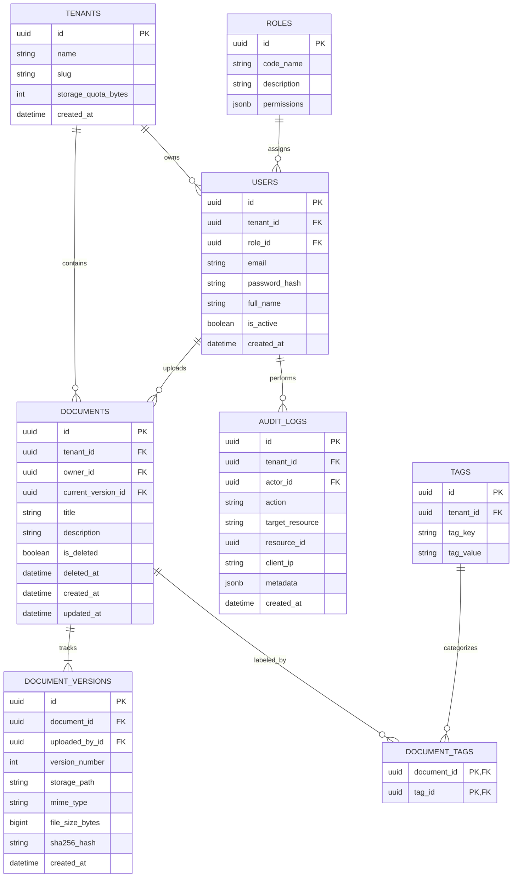

# VaultDocs — Database Design Specification

> **Document ID:** DOC-004
> **Version:** 1.0.0
> **Status:** Approved
> **Author:** Pavan (Software Architect / Project Lead)
> **Contributors:** Raj (Backend Developer), Tirth (Backend Developer)
> **Created Date:** 2026-07-20
> **Last Updated:** 2026-07-20
> **Classification:** Internal Engineering Documentation

---

## Executive Summary

This Database Design Specification defines the relational data models, schema layout, entity relationships, index optimization strategies, soft deletion rules, audit tracking schema, and Alembic migration policies for VaultDocs. VaultDocs utilizes **PostgreSQL 17+** as its primary relational engine, engineered to ensure strict data integrity, sub-second query performance, and horizontal read scaling.

---

## Table of Contents

1. [Database Engine Selection & Rationale](#1-database-engine-selection--rationale)
2. [Entity-Relationship Diagram (ERD)](#2-entity-relationship-diagram-erd)
3. [Core Entity Specifications & Tables](#3-core-entity-specifications--tables)
4. [Primary & Foreign Key Strategy](#4-primary--foreign-key-strategy)
5. [Indexing & Query Optimization Strategy](#5-indexing--query-optimization-strategy)
6. [Database Naming Standards](#6-database-naming-standards)
7. [Document Versioning & Delta Strategy](#7-document-versioning--delta-strategy)
8. [Soft Delete Pattern](#8-soft-delete-pattern)
9. [Alembic Migration & Schema Governance](#9-alembic-migration--schema-governance)
10. [Backup, Recovery & Data Retention](#10-backup-recovery--data-retention)

---

## 1. Database Engine Selection & Rationale

VaultDocs standardizes on **PostgreSQL 17+** as its primary datastore based on the following enterprise engineering requirements:

1. **Acid Compliance & Transaction Isolation:** Guarantees strict multi-table transaction atomicity across complex document versioning and audit operations.
2. **Native JSONB Data Types:** Provides high-performance indexing on unstructured document metadata and custom dynamic tags.
3. **Built-in Full-Text Search (GIN Indexes):** Enables native `tsvector` keyword search across document catalog attributes without requiring an external Elasticsearch deployment.
4. **Row-Level Security (RLS) & Multi-Tenancy Support:** Enables future database-level tenant isolation policy enforcement.

---

## 2. Entity-Relationship Diagram (ERD)



---

## 3. Core Entity Specifications & Tables

### 3.1 Table: `tenants`
Stores top-level organizational accounts for multi-tenant isolation.

| Column | Type | Constraints | Description |
| :--- | :--- | :--- | :--- |
| `id` | `UUID` | `PRIMARY KEY` | Time-ordered UUID v7. |
| `name` | `VARCHAR(255)` | `NOT NULL` | Organization display name. |
| `slug` | `VARCHAR(100)` | `NOT NULL, UNIQUE` | Unique URL-friendly slug. |
| `storage_quota_bytes`| `BIGINT` | `NOT NULL, DEFAULT 53687091200` | Quota limit (default 50 GB). |
| `created_at` | `TIMESTAMPTZ` | `NOT NULL, DEFAULT NOW()` | Record creation timestamp. |

---

### 3.2 Table: `users`
Stores authenticated enterprise user credentials and tenant associations.

| Column | Type | Constraints | Description |
| :--- | :--- | :--- | :--- |
| `id` | `UUID` | `PRIMARY KEY` | Time-ordered UUID v7. |
| `tenant_id` | `UUID` | `NOT NULL, FK -> tenants(id)` | Associated tenant context. |
| `role_id` | `UUID` | `NOT NULL, FK -> roles(id)` | Assigned RBAC role. |
| `email` | `VARCHAR(255)` | `NOT NULL, UNIQUE` | Primary user login email. |
| `password_hash` | `VARCHAR(255)` | `NOT NULL` | Salted Argon2id password hash. |
| `full_name` | `VARCHAR(255)` | `NOT NULL` | User full display name. |
| `is_active` | `BOOLEAN` | `NOT NULL, DEFAULT True` | Active state flag. |
| `created_at` | `TIMESTAMPTZ` | `NOT NULL, DEFAULT NOW()` | Creation timestamp. |

---

### 3.3 Table: `documents`
Stores document aggregate metadata pointers and current version references.

| Column | Type | Constraints | Description |
| :--- | :--- | :--- | :--- |
| `id` | `UUID` | `PRIMARY KEY` | Unique document identifier. |
| `tenant_id` | `UUID` | `NOT NULL, FK -> tenants(id)` | Owning tenant identifier. |
| `owner_id` | `UUID` | `NOT NULL, FK -> users(id)` | Document creator / owner. |
| `current_version_id`| `UUID` | `NULLABLE, FK -> document_versions(id)` | Pointer to current head version. |
| `title` | `VARCHAR(255)` | `NOT NULL` | Document title string. |
| `description` | `TEXT` | `NULLABLE` | Detailed description text. |
| `is_deleted` | `BOOLEAN` | `NOT NULL, DEFAULT False` | Soft delete flag. |
| `deleted_at` | `TIMESTAMPTZ` | `NULLABLE` | Soft deletion timestamp. |
| `created_at` | `TIMESTAMPTZ` | `NOT NULL, DEFAULT NOW()` | Document creation timestamp. |
| `updated_at` | `TIMESTAMPTZ` | `NOT NULL, DEFAULT NOW()` | Last update timestamp. |

---

### 3.4 Table: `document_versions`
Stores immutable version records for every uploaded binary payload.

| Column | Type | Constraints | Description |
| :--- | :--- | :--- | :--- |
| `id` | `UUID` | `PRIMARY KEY` | Version record UUID v7. |
| `document_id` | `UUID` | `NOT NULL, FK -> documents(id) ON DELETE CASCADE` | Parent document aggregate. |
| `uploaded_by_id` | `UUID` | `NOT NULL, FK -> users(id)` | User who uploaded this version. |
| `version_number` | `INTEGER` | `NOT NULL` | Monotonically increasing version int. |
| `storage_path` | `VARCHAR(512)` | `NOT NULL` | Relative file path in storage vault. |
| `mime_type` | `VARCHAR(100)` | `NOT NULL` | Standard MIME content type string. |
| `file_size_bytes` | `BIGINT` | `NOT NULL` | Exact binary payload size. |
| `sha256_hash` | `CHAR(64)` | `NOT NULL` | Cryptographic SHA-256 integrity hash. |
| `created_at` | `TIMESTAMPTZ` | `NOT NULL, DEFAULT NOW()` | Timestamp version was committed. |

---

### 3.5 Table: `audit_logs`
Stores immutable governance and event records.

| Column | Type | Constraints | Description |
| :--- | :--- | :--- | :--- |
| `id` | `UUID` | `PRIMARY KEY` | Audit record UUID v7. |
| `tenant_id` | `UUID` | `NOT NULL, FK -> tenants(id)` | Tenant scope. |
| `actor_id` | `UUID` | `NOT NULL, FK -> users(id)` | Performing user ID. |
| `action` | `VARCHAR(100)` | `NOT NULL` | Action code (e.g., `DOC_UPLOAD`). |
| `target_resource` | `VARCHAR(100)` | `NOT NULL` | Resource type (e.g., `document`). |
| `resource_id` | `UUID` | `NOT NULL` | Target resource UUID. |
| `client_ip` | `VARCHAR(45)` | `NOT NULL` | Client IPv4 / IPv6 address string. |
| `metadata` | `JSONB` | `NOT NULL, DEFAULT '{}'` | Additional contextual JSON data. |
| `created_at` | `TIMESTAMPTZ` | `NOT NULL, DEFAULT NOW()` | Immutable log timestamp. |

---

## 4. Primary & Foreign Key Strategy

1. **UUID v7 Primary Keys:** All primary keys utilize UUID v7 values. Time-ordered prefixing prevents database index fragmentation while eliminating sequential key enumeration vulnerabilities.
2. **Foreign Key Integrity & Cascading Rules:**
   - `document_versions -> documents`: `ON DELETE CASCADE` ensures versions are cleaned up if a parent document is purged.
   - `documents -> tenants` & `documents -> users`: `ON DELETE RESTRICT` prevents deleting active tenant accounts or users who own active documents.

---

## 5. Indexing & Query Optimization Strategy

VaultDocs applies targeted B-Tree, GIN, and Partial Indexing strategies to guarantee query execution under 50ms:

```sql
-- 1. Partial Index for Active Documents (Excludes Soft Deleted Records)
CREATE INDEX idx_documents_tenant_active
ON documents (tenant_id, created_at DESC)
WHERE is_deleted = FALSE;

-- 2. GIN Index for PostgreSQL Full-Text Keyword Search
CREATE INDEX idx_documents_fulltext_search
ON documents
USING GIN (to_tsvector('english', title || ' ' || COALESCE(description, '')));

-- 3. Composite Index for Version Lookups
CREATE UNIQUE INDEX idx_document_versions_lookup
ON document_versions (document_id, version_number DESC);

-- 4. B-Tree Index for User Email Lookup
CREATE UNIQUE INDEX idx_users_email
ON users (LOWER(email));

-- 5. Audit Log Index for Time-Series Tenant Queries
CREATE INDEX idx_audit_logs_tenant_created
ON audit_logs (tenant_id, created_at DESC);
```

---

## 6. Database Naming Standards

1. **Tables:** Snake_case, plural nouns (e.g., `documents`, `audit_logs`).
2. **Columns:** Snake_case, singular names (e.g., `storage_path`, `is_active`).
3. **Foreign Keys:** Entity singular name + `_id` suffix (e.g., `tenant_id`, `owner_id`).
4. **Timestamps:** Standardize on `TIMESTAMPTZ` with `_at` suffix (e.g., `created_at`, `deleted_at`).

---

## 7. Document Versioning & Delta Strategy

Document versions are modeled as immutable head-to-tail records:
1. When a new version is uploaded, a row is added to `document_versions` with `version_number = current_max + 1`.
2. The parent `documents.current_version_id` foreign key is updated to point to the newly inserted version record inside a single database transaction.

---

## 8. Soft Delete Pattern

To prevent accidental data loss and support compliance restoration:
1. `DELETE /api/v1/documents/{id}` executes an `UPDATE documents SET is_deleted = TRUE, deleted_at = NOW() WHERE id = :id`.
2. All standard queries automatically apply `WHERE is_deleted = FALSE` filtering via repository layer defaults.
3. System Admins can perform hard purges via explicit administrative purge services.

---

## 9. Alembic Migration & Schema Governance

Schema changes are strictly managed via **Alembic**:
1. Manual database DDL modifications in production or dev environments are forbidden.
2. Every schema change requires a migration script generated via `uv run alembic revision --autogenerate -m "description"`.
3. All migrations must implement both `upgrade()` and `downgrade()` methods.

---

## 10. Backup, Recovery & Data Retention

1. **Point-In-Time Recovery (PITR):** PostgreSQL Write-Ahead Logging (WAL) archiving enabled for 30-day point-in-time recovery capabilities.
2. **Daily Automated Snapshots:** Full daily database backups encrypted using AES-256 and stored offsite.
3. **RTO & RPO Objectives:**
   - **Recovery Time Objective (RTO):** `< 1 Hour`
   - **Recovery Point Objective (RPO):** `< 5 Minutes` (WAL stream)
